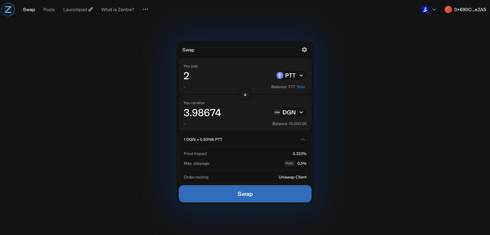

# Horswap

An open source interface for Uniswap -- a protocol for decentralized exchange of Ethereum tokens.

Check out Horswap via:
- [https://2.horswap.eth.limo](https://2.horswap.eth.limo)
- [ipns://2.horswap.eth](ipns://2.horswap.eth)
- [ipfs://bafybeibtdjzmhx77pxlpmy7fqnwyb7dmrtwbk3n6fpyw3qdgmxaznzwm44](ipfs://bafybeibtdjzmhx77pxlpmy7fqnwyb7dmrtwbk3n6fpyw3qdgmxaznzwm44)

# Horswap is an improved Uniswap Interface
Horswap is a fork of [Uniswap Interface v4.266.2](https://github.com/Uniswap/interface/releases/tag/v4.266.2). The version v4.266.2 is the last version without added UI fees and that would still allow users to do local routing. Horswap has then significantly improved the interface's censorship resistance and privacy.

You can read about reasoning on why Horswap was built here: [https://listed.to/authors/33689/posts/49312](https://listed.to/authors/33689/posts/49312)

Here are the significant changes:
- Changed Uniswap branding to Horswap branding
- Removed Uniswap privacy policy
- Removed all analytics queries (Uniswap interface is really noisy in reporting everything you do to their analytics system)
- Removed support for wallet connect wallets (Unfortunately these require centralized server to function)
- Changed socials to point to dark.florist equivalents
- Removed copyright notices for Uniswap
- Removed blacklisted tokens and user addresses
- Replaced the default RPC (Infura, which censors) with Keydonix (does not censor)
- Removed Moonpay (a centralized fiat payment processsor)
- Removed NFT related features (unfortunately these only function by using centralized services)
- Removed Subgraph (unfortunately this is also a centralized service)
- Removed pages that require subgraph (mini portfolio, portfolio, NFTs, token pages, pool details, search bar etc)
- Removed fiat currency selector (requires subgraph)
- Removed external routing, all routing is done using the default RPC or users wallet RPC
- Removed UniswapX (UniswapX depends on centralized servers)
- Settings have been moved to where the mini portfolio used to be
- Changed token pricing to be from a simulated swap with USDC, and it is shown to users that this is in USDC (not in dollars)
- Removed claim UNI tokens popup
- Added docker building and deployment to IPFS

You can see all the changes by [comparing Horseswap to Uniswap Interface V4.266.2](https://github.com/Uniswap/interface/compare/v4.266.2...DarkFlorist:Horswap:main)

# Socials
- Website: [dark.florist](https://www.dark.florist/)
- Uniswap Docs: [uniswap.org/docs/](https://docs.uniswap.org/)
- Twitter: [@DarkFlorist](https://twitter.com/DarkFlorist)
- Discord: [Dark Florists](https://discord.com/invite/aCSKcvf5VW)
- Uniswap Whitepapers:
  - V1 ipfs://bafybeihyq5jjttgmfdsonnbv73cshadkd3c3m3dptcrhqjeds6xij6rlim/ [dweb](https://bafybeihyq5jjttgmfdsonnbv73cshadkd3c3m3dptcrhqjeds6xij6rlim.ipfs.dweb.link/)
  - V2 ipfs://bafybeia5cxs72meianwphz2aq2tv5irpdgmkfniqsuhznl66s677zakgce/ [dweb](https://bafybeia5cxs72meianwphz2aq2tv5irpdgmkfniqsuhznl66s677zakgce.ipfs.dweb.link/)
  - V3 ipfs://bafybeifgsqhf44fqxz4fnhomgwxy3666vrat2zu4djs5rgvjopatcfe42y/ [dweb](https://bafybeifgsqhf44fqxz4fnhomgwxy3666vrat2zu4djs5rgvjopatcfe42y.ipfs.dweb.link/)
